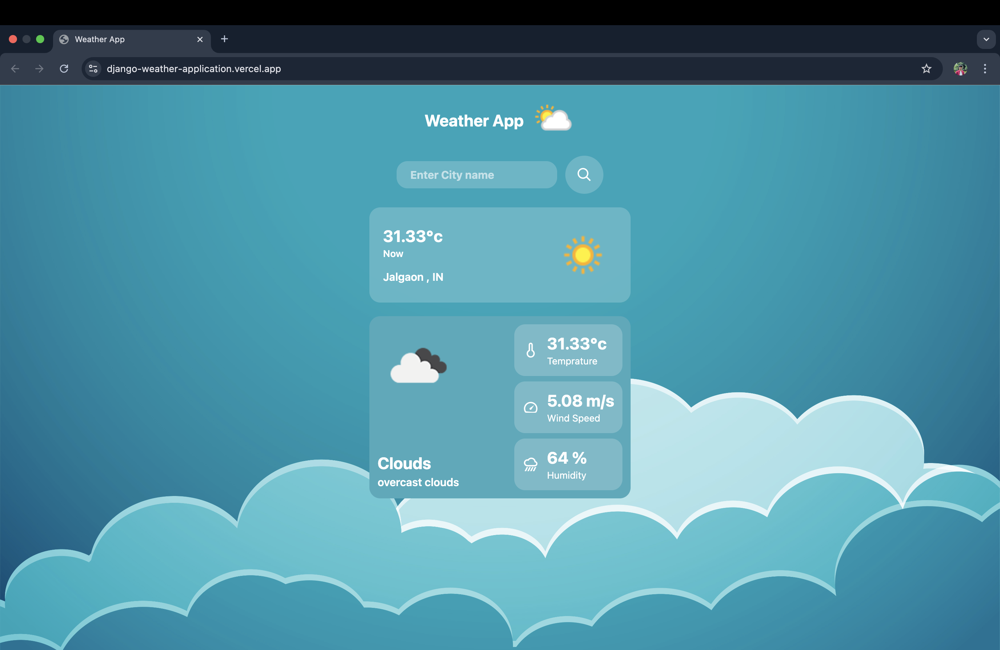

# 🌤️ Django Weather Application

A simple and elegant **Django-based Weather App** that fetches real-time weather data using the [OpenWeatherMap API](https://openweathermap.org/api).  
It allows users to search for any city worldwide and displays temperature, wind speed, humidity, and current weather conditions with a modern UI.

<p align="center">
  
</p>

---

## 🚀 Live Demo

👉 Try it here: [https://django-weather-application.vercel.app/](https://django-weather-application.vercel.app/)

---

## ✨ Features

- 🌍 Search weather by **city name**  
- 🌡️ Displays **temperature** (°C)  
- 💨 Shows **wind speed** (m/s)  
- 💧 Provides **humidity percentage**  
- ☁️ Displays **weather conditions** (clouds, clear sky, rain, etc.)  
- 🎨 Clean, responsive, and modern UI  
- ⚡ Deployed on **Vercel** using Django serverless functions  

---

## 🧱 Tech Stack

- **Backend:** Django (Python)
- **Frontend:** HTML, CSS, JavaScript
- **API:** [OpenWeatherMap API](https://openweathermap.org/api)
- **Hosting:** [Vercel](https://vercel.com/)

---

## 📦 Project Structure

```
Django-Weather-Application/
├── weather/                # Main Django app
│   ├── templates/weather/   # HTML templates
│   │   ├── index.html
│   └── views.py             # API logic
├── weather_project/         # Django project config
│   ├── settings.py
│   └── urls.py
├── static/                  # CSS, JS, Images
├── requirements.txt
├── manage.py
└── screenshots/
    └── 01-home.png
```

---

## 🚀 Getting Started (Local Setup)

### 1) Clone the repo
```bash
git clone https://github.com/Er-Mayur/Django-Weather-Application.git
cd Django-Weather-Application
```

### 2) Create & activate a virtual environment
```bash
# macOS / Linux
python3 -m venv .venv
source .venv/bin/activate

# Windows (PowerShell)
py -m venv .venv
.venv\Scripts\Activate.ps1
```

### 3) Install dependencies
```bash
pip install -r requirements.txt
```

### 4) Get OpenWeatherMap API Key  
- Sign up at [OpenWeatherMap](https://home.openweathermap.org/users/sign_up)  
- Generate an API key  
- Add it to your **settings.py** or `.env` file:  

```python
API_KEY = "your_api_key_here"
```

### 5) Run the app
```bash
python manage.py runserver
```
Open your browser at **http://127.0.0.1:8000**.

---

## ⚙️ Deployment Notes (Vercel)

- The app is deployed using **Vercel’s Python Runtime**  
- Static files are served from `/static/`  
- Django runs as a serverless function (`api/index.py`)  
- Update your `vercel.json` for routes and static handling  

---

## 🙌 Acknowledgements

- Built with ❤️ using **Django**  
- Weather data powered by **OpenWeatherMap API**  
- Hosted on **Vercel**  

---
